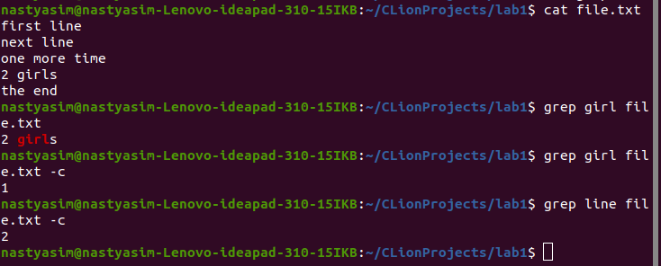
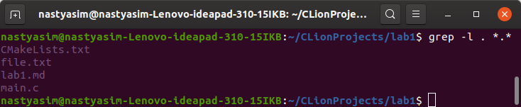
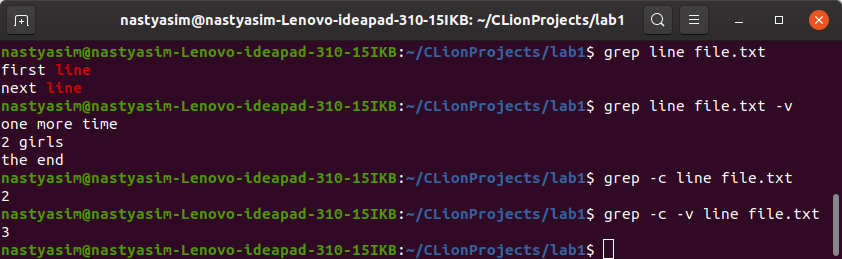
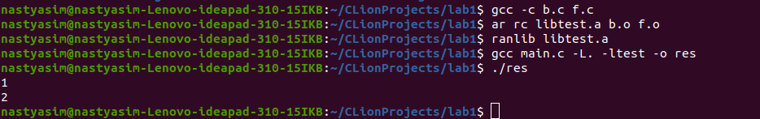
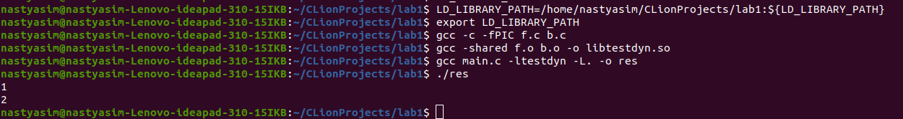
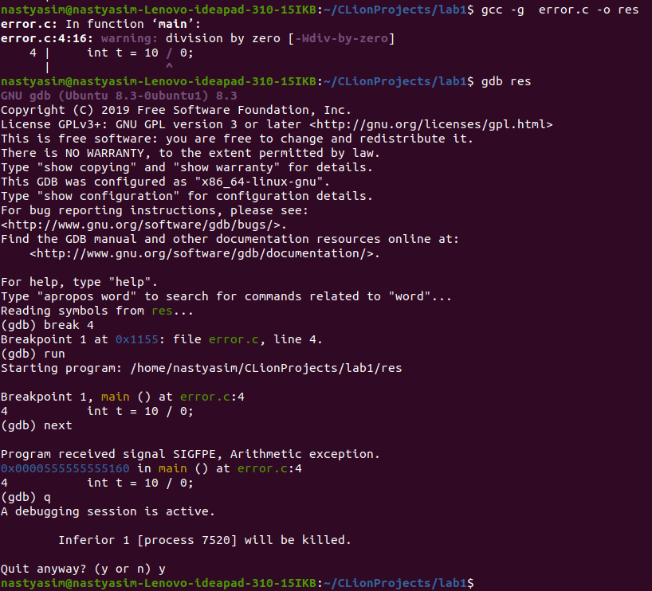
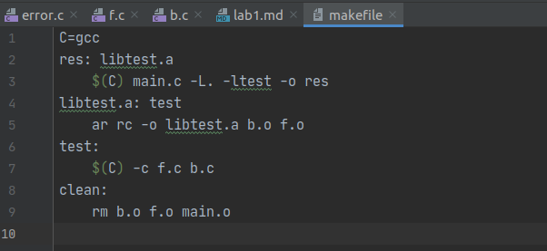

## Лабораторная работа №1.
### Программирование на C в Unix-среде: инструменты (gcc, gdb, ...), библиотеки (header files), документация (man pages)
+ Редактор + использование grep    
    Редактор - Clion  
    `grep` - утилита командной строки Linux, ищет в файлах целые строки в файле по шаблону (регулярному выражению)   
    Флаги:  
    `-с` - вывод количества подходящих строк    
      
    `-l` - вывод названий файлов, в которых найден шаблон  
      
    `-v` - инвертирует вывод  
      
    
+ Компиляция и полезные флаги    
    `-o` - задать название выходного файла  
    `-E` - только препроцессинг  
    `-S` - генерация кода ассемблера  
    `-c` - компиляция исходных файлов в объектные файлы (без компоновки)  
    `-g` - создать отладочную информацию для работы с отладчиком        
    `-O` - задать уровень оптимизации  
    `-Wall` - вывести все предупреждения компилятора  
    `nm` - выводит информацию о бинарных файлах (прежде всего таблицу символов)
    `ld` - объединяет несколько объектных файлов в один, размещает команды и данные, разрешает внешние ссылки и генерирует таблицу символов  
      
+ Подключение статической библиоткеки:    
        
    1. Для создания статических библиотек существует `ar`, используется для создания, модификации 
    и просмотра объектных файлов в статических библиотеках. Опция c заставляет создавать библиотеку, если ее нет, а опция r заменяет старые объектные файлы новыми версиями.   
    2. Koмaндa `ranlib` cтpoит для yкaзaнныx библиoтeк oбъeктныx фaйлoв oглaвлeниe. B нeм пepeчиcлeны вce внeшниe имeнa из oбъeктныx фaйлoв, cocтaвляющиx библиoтeкy, что ускоряет линковку.  
    3. Для компиляции main.c надо сообщить компилятору, что требуется использовать библиотеки. Чтобы компилятор знал, где искать библиотеки, 
    ему надо сообщить каталог, в котором они содержатся и список этих библиотек. 
    Каталог с библиотеками указывается ключом `-L`, используемые библиотеки перечисляются через ключ `-l`, 
    после которого указывается название библиотеки (без префикса lib и окончания .a). В нашем случае 
     `-ltest`.  
     
+ Подключение динамической библиотеки:  
      
    1) Для подключения динамической библиотеки требуется указать каталог, где находится библиотека, 
    в переменной окружения `LD_LIBRARY_PATH`.  
    2) Создаём объектные файлы, используя флаг `-fPIC`, чтобы сгенерировать 
    PIC - программу, которая может быть размещена в любой области памяти, так 
    как все ссылки на ячейки памяти в ней будут относительными. 
    3) С помощью `-shared` создаём динамическую библиотеку.  
    
+ Отладка простой программы с помощью GDB:  
      
    Чтобы воспользоваться отладчиком, необходимо указать ключ `-g`.    
+ Применение Makefile для автоматизации  
      
    Чтобы автоматизировать сборку программы, используем `make` и специальные файлы (обычно Makefile).  
    В файле имеются правила  
    ```
        цель: зависимости  
        [tab] команда
    ```  
    `make` при вызове последовательно выполнит все 
    указанные зависимости этой цели.
    ОБъявляем переменные до их использования, при использовании разыменовывем, используя `$`, например ```$(VAR_NAME)```     
    Последняя цель - clean - для очистки от промежуточных файлов.  
