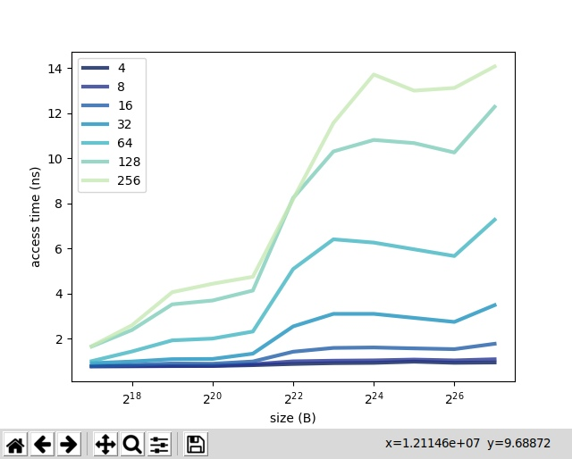

## Лабораторная работа № 12.

Проанализируйте cache.c  и с ее использованием исследуйте параметры кэша на вашем компьютере. Для этого 
1. постройте графики времени доступа как функции длины массива, шага выборки и размера буфера. 
2. на их основе сформулируйте обоснованные гипотезы о  размере кэша, размере блока, наличию кэша более высокого уровня. 
3. сравните свои оценки с реальными значениями, полученными через вызов системных функций или из технического описания вашего компьютера.

  

На графике видим, что производительность значительно падает, если размер массива > 2^21, т.е. мы предполагаем, что размер кэша примерно 2 MiB.
Также видим ухудшение производительности при stride = 64, поэтому предполагаем, что размер блока 128. 

L1d cache:                       64 KiB  
L1i cache:                       64 KiB  
L2 cache:                        512 KiB  
L3 cache:                        3 MiB    
cache_alignment : 64  

