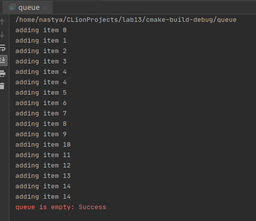

## Лабораторная работа № 13
### Поставщики и потребители (с ограниченным буфером) (Producer/Consumer (Bounded Buffer) Problem)  

Разработать план  (что, зачем и как тестируется)  для трех вариантов кода и прокомментировать результаты тестирования.  

+   Первый вариант кода - реализована не потокобезопасная очередь.  
    
    Проблемы:  
    + Разные потоки могут вызывать next_in и next_out одновременно (она оказывается в “противоречивом” состоянии), решение с пом. Mutex;  
    + Если первый в очереди потребитель обнаруживает пустую очередь, он печатает сообщение об ошибке и завершает, а должен ждать (перейти в состояние Blocked), когда очередь пополнится, решение с пом. условных переменных.  
      
    Тестирование:  
    + Создаётся общая очередь;
    + Создаются два потока, первый кладёт в очередь элементы, второй их извлекает.  
      
    Второй поток обнаруживает пустую очередь, выводит сообщение об ошибке, завершает выполнение, в это время первый поток добавляет в очередь элементы.   
    
      

+   Второй вариант кода - реализация очереди с мьютексом.
    Теперь добавим мьютекс, в операции добавления и удаления элементов очереди добавим синхронизацию мьютексом.  
      
    Тестирование:  
    + Создаётся общая очередь  
    + Создаются два потока, первый кладёт в очередь элементы, второй их извлекает.  
    
    Второй поток обнаруживает пустую очередь, выводит сообщение об ошибке, завершает выполнение, в это время первый поток добавляет в очередь элементы. В отличие от первой реализации операции добавления и удаления элементов из очереди атомарны.  
    
+   Третий вариант кода - добавим в структуру условную переменную.  
    Условная переменная – это структура данных, связанная с условием для блокировки потока до момента, когда условие не станет выполненным в связи с изменениями, вносимых другими потоками.
    Добавим к структуре очереди поля   
    ```
    Cond *nonempty;
    Cond *nonfull;
    ```
    В функции queue_pop() к проверке на пустую очередь добавим блокировку:  
    ```
    while (queue_empty(queue)) {
        cond_wait(queue->nonempty, queue->mutex);
      }
    ```
    Пусть в конце функции поток "сигнализирует" условную переменную, давая понять, что очередь не полная   
    ```
    cond_signal(queue->nonfull);
    ```
    Аналогично для queue_push().  
    
    Тестирование:
    + Создаётся общая очередь
    + Создаются два потока, первый кладёт в очередь элементы, второй их извлекает.  
        Второй поток обнаруживает пустую очередь, блокируется до момента, пока не получит сигнал, что очередь не пустая.  
        В это время первый поток добавляет элементы, сигнализируя, что очередь не пустая.
        