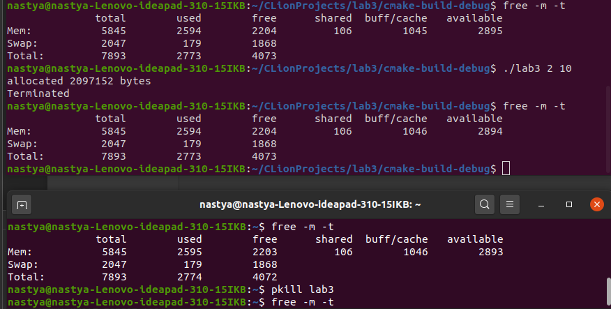
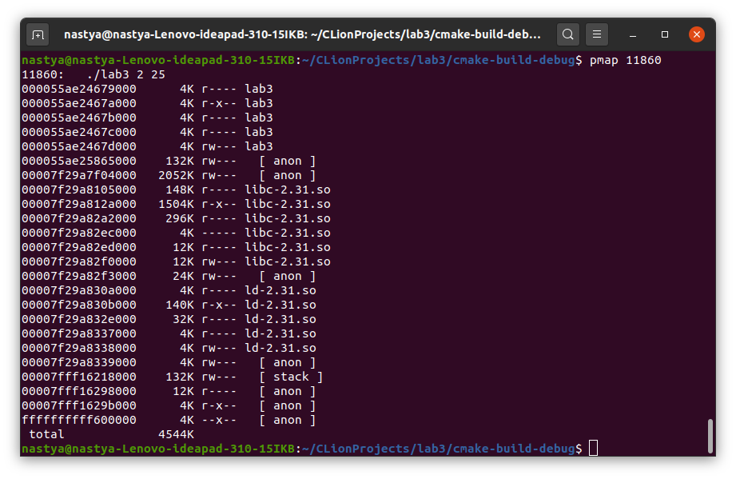
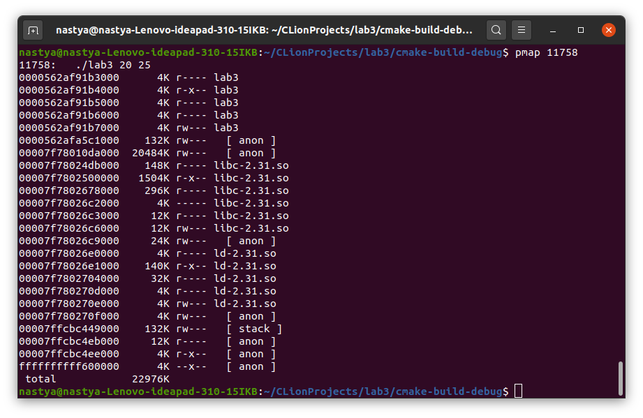

## Лабораторная работа № 3.
### Использование виртуальной памяти.

0) Ознакомиться со структурой виртуальной памяти и инструментами для работы с ней.
1) Разработать программу memory-user.c, которая принимает на вход количество Mb памяти, 
которую она резервирует и в которой она размещает массив, 
а затем перебирает все его элементы в бесконечном цикле 
или заданное количество времени, которое также вводится по запросу.   
2) Пока программа memory-user.c выполняется при различных объемах запрошенной памяти 
(включая значительные), из другого терминала выполнить запрос free(). 
Проанализировать результаты распределения памяти до и после завершения memory-user.c с 
помощью kill.

Команда free выводит данные:  
    + Total. Эта цифра представляет всю существующую память.
    + Used вычисление общего значения оперативной памяти системы за вычетом выделенной свободной, разделяемой, буферной и кэш-памяти.
    + Free – это память, которая не используется ни для каких целей.
    + Shared, Buffer, и Cache идентифицируют память, используемую для нужд ядра / операционной системы. Буфер и кеш складываются вместе, а сумма указывается в разделе «buff/cache».
    + Available память появляется в более новых версиях free и предназначена для того, чтобы дать конечному пользователю оценку того, сколько ресурсов памяти все еще открыто для использования.    

С помощью `free -m -t` посмотрим, сколько мб памяти было свободно до начала программы.  
Затем во время выполнения программы посмотрим из другого окна терминала, сколько 
сейчас свободно памяти, а после командой `pkill lab3` отправим процессу сигнал для завершения процесса.
Как видим, после завершения процесса память освободилась.     

3) Исследовать распределение памяти для memory-user.c с использованием pmap 
при различных объемах запрошенной памяти (включая значительные).  
pmap – Использование памяти процессами.
Команда детально расписывает использование оперативной памяти процессами в системе.  
Запустим нашу программу, запросим 2 мб.   

Теперь 20 мб памяти.   

