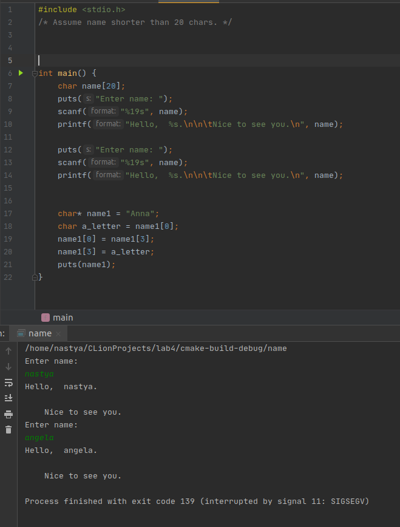
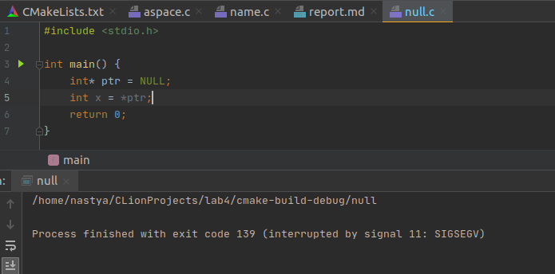
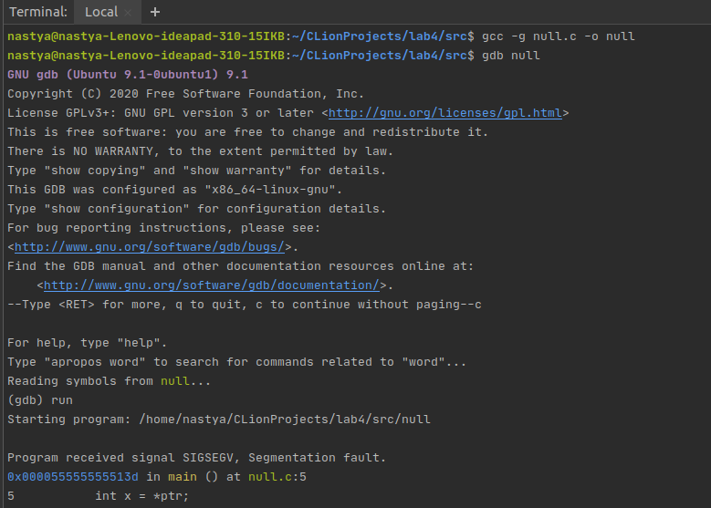
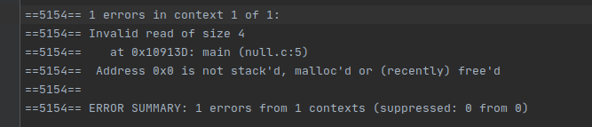
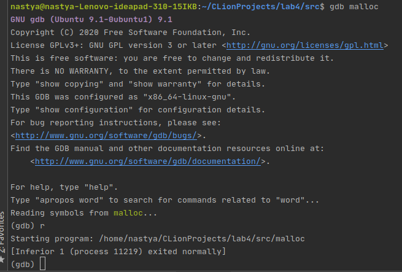
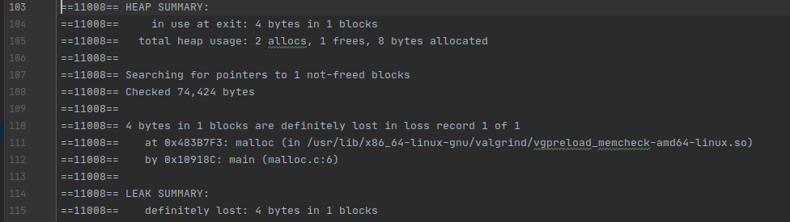
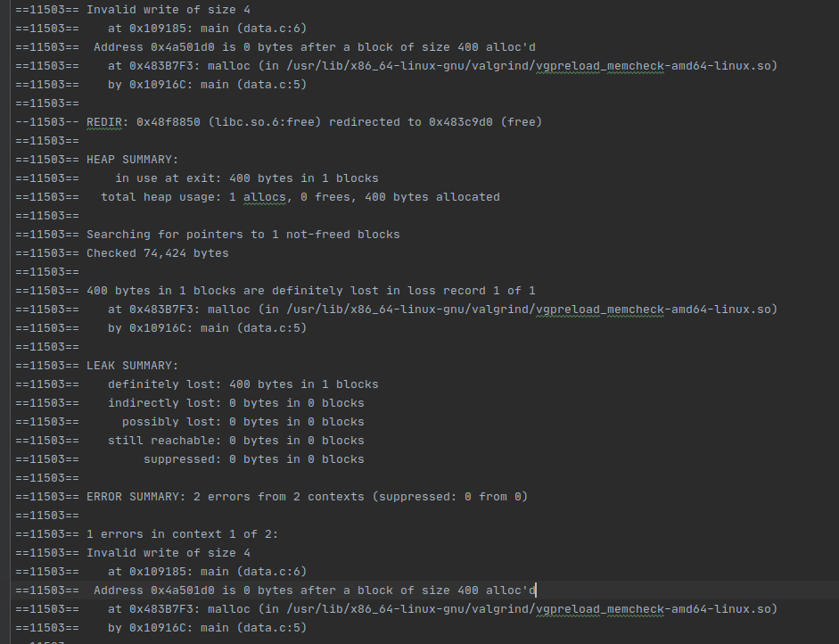
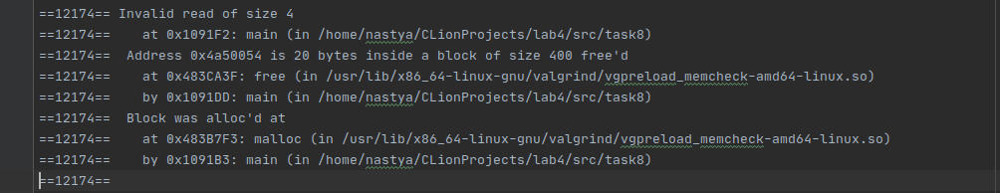

## Лабораторная работа № 4.
### Использование виртуальной памяти. Выявление ошибок с использованием gdb и valgrind.
1)  + В программу aspace.c добавить malloc() и выяснить в каком направлении происходит добавление динамической памяти (к старшим адресам).   
    ```
    Address of p is 		0x5604d6f982a0
    Address of ptr is 		0x5604d6f982f0
    ```
    Т.к. ptr была инициализирована позже, адрес у неё больше.  
    + Добавить локальную переменную и проверить то, что в стеке адреса задействуются в сторону убывания.  
    ```c
    void f() {
        int f_local = 5;
        printf("Address of f_local is \t%p\n", &f_local);
    }
    
    int main() {
        /* ... */
        int local = 5;
        int local1 = 5;
        int local2 = 5;
        /* ... */
    }
    ```
    Хотя local1 и local2 были объявлены позже переменной local, их адреса больше. Но адрес локальной переменной f_local из функции, которую вызвали после объявления перменных local, local1, local2, меньше адресов этих переменных, значит, адреса на стеке растут вниз.
    ```
    Address of f_local is 	0x7fff9928b1c4
    Address of local is 	0x7fff9928b1ec
    Address of local1 is 	0x7fff9928b1f0
    Address of local2 is 	0x7fff9928b1f4
    ```
    + Как найти адрес указателя? Что возвращается при оценивании p и &p?
    Указатель - тоже переменная, поэтому мы можем получить адрес с помощью &.
    ```c
    printf("Address of &p is \t\t%p\n", &p);
    ```
2) Объяснить поведение фрагмента кода для переменных name и name1
   Данный код завершается с ошибкой:  
     
   
   ```
   char* name1 = "Anna";
   ```
   Ошибка из-за того, что строковый литерал "Anna" будет лежать в области памяти, 
   доступной только для чтения. Компилятор не считает это ошибкой, т.к. указатель 
   не объявлен как константный.  Чтобы программа работала, нужно поменять эту строку на 
   ```
   char name1[] = "Anna";
   ```
   Тогда name1 будет массивом, который можно изменять. В данном случае строковый литерал 
   скопируется в массив, на который будет ссылаться name1.
3)  Разработать программу null. c, которая создает указатель на целое и 
    устанавливает его в NULL Затем она пытается получить значение переменной по 
    указателю (dereference). 
    Объяснить результат запуска откомпилированной программы.  
      
    NULL - специальный указатель, удобный способ «отметить» указатели, которые заведомо 
    не указывают на корректный адрес в памяти. Обращение по нему является неопределённым 
    поведением. В нашем случае программа завершилась с SIGSEGV — сигналом, 
    посылаемым процессу при попытке обращения к несуществующей памяти или обращения с 
    нарушением прав доступа. 
    
4)  Откомпилировать null.c с ключом -g, запустить dbg null и вызвать команду run. Объяснить реакцию отладчика.    
       
    
5)  Установить и использовать valgrind (memcheck) для анализа ситуации из 4: 
    ```
    valgrind --leak-check=yes null 
    valgrind --leak-check=full --show-leak-kinds=all --track-origins=yes --verbose --log-file=valgrind-out.txt null.    
    ```
        
    Valgrind хорошо известен как мощное средство поиска ошибок работы с
    памятью. Но кроме этого, в его составе имеется некоторое количество
    дополнительных утилит, предназначенных для профилирования программ,
    анализа потребления памяти и поиска ошибок связанных с синхронизацией в
    многопоточных программах.  
    
    memcheck - это основной модуль, обеспечивающий обнаружение утечек памяти, 
    и основной модуль, обеспечивающий обнаружение утечек памяти, и прочих ошибок, 
    связанных с неправильной работой с областями памяти -- чтением или записью за 
    пределами выделенных регионов и т.п.
    
    Опции:  
    
    --verbose (или -v) заставляет valgrind выводить подробную информацию о своей работе.  
    -log-file позволяет задать имя файла в который будет выводиться отчет о работе.  
    --leak-check включает (значение yes, summary или full) или отключает
    (значение no) функцию обнаружения утечек памяти.  
    
       
    Как видим, попытка обратиться по адресу 0x0 вызвала ошибку. 
6)  Написать простую программу, которая использует malloc(), но не освобождает память по завершению. Использовать gdb и valgrind для того, чтобы объяснить ошибку.  
      
    GDB не сообщает об утечке памяти.  
      
    Сообщение об ошибке говорит, что есть неосвобождённая память после выполнения malloc() на 6 строке.
7)  Написать программу, которая создает массив целых data размера 100, используя malloc(). Установить data[100] в 0. Запустить программу и найти ошибку (если есть) с помощью valgrind.  
    Выполнение программы завершается без ошибок. Однако valgrind выводит сообщение:  
      
    Первая ошибка: запись по адресу, к которому нет досутпа.  
    Вторая ошибка: снова утечка памяти.
8)  Написать программу, которая создает массив целых (как в 7), освобождает его и пытается напечатать значение какого-либо элемента. Диагностировать ошибку с использованием valgrind.  
      
    Ошибка: чтение по адресу, который в 20 байтах от начала освобождённого ранее блока, также указано, на какой строке этот блок памяти был выделен. 