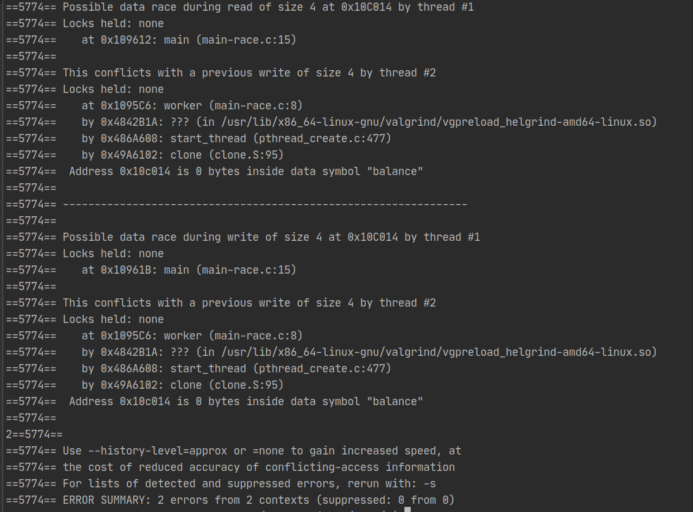

## Лабораторная работа №9.
### Обнаружение и устранение проблем в многопотоковых программах с использованием helgrind.

1. Установить (make) набор программ (см. Makefile) из архива  (см. также http://www.ostep.org).
2. С помощью helgrind (valgrind --tool=helgrind main-race) в программе main-race.c проанализировать ошибки в коде, связанные с несинхронизованностью потоков команд, работающих с общими данными (data race), и попытаться их устранить.
      
      
      
    Ошибка - обращение к участку памяти (переменная balance) из разных потоков, создающее data race.
    Решение - мьютексы. Создаём мьютекс, при обращении к переменно balance замыкаем его, после ооперации с этой переменной размыкаем мьютекс.

3. В программе main-deadlock.c имеется ошибка, называемая мёртвая блокировка (deadlock, ситуация, при которой один поток (поток A), ждет ресурса, удерживаемого другим потоком (потоком B), и при этом удерживает ресурс, который нужен потоку B. Поскольку потоки A и B блокированы в ожидании ресурсов, удерживаемых другим потоком, выполнения не происходит). Использовать helgrind и проинтерпретировать отчет.
   
        ==6626== Helgrind, a thread error detector
        ==6626== Copyright (C) 2007-2017, and GNU GPL'd, by OpenWorks LLP et al.
        ==6626== Using Valgrind-3.15.0 and LibVEX; rerun with -h for copyright info
        ==6626== Command: ./main-deadlock
        ==6626== 
        ==6626== ---Thread-Announcement------------------------------------------
        ==6626== 
        ==6626== Thread #3 was created
        ==6626==    at 0x49A60F2: clone (clone.S:71)
        ==6626==    by 0x48692EB: create_thread (createthread.c:101)
        ==6626==    by 0x486AE0F: pthread_create@@GLIBC_2.2.5 (pthread_create.c:817)
        ==6626==    by 0x4842917: ??? (in /usr/lib/x86_64-linux-gnu/valgrind/vgpreload_helgrind-amd64-linux.so)
        ==6626==    by 0x109513: Pthread_create (mythreads.h:51)
        ==6626==    by 0x109654: main (main-deadlock.c:24)
        ==6626== 
        ==6626== ----------------------------------------------------------------
        ==6626== 
        ==6626== Thread #3: lock order "0x10C040 before 0x10C080" violated
        ==6626== 
        ==6626== Observed (incorrect) order is: acquisition of lock at 0x10C080
        ==6626==    at 0x483FEDF: ??? (in /usr/lib/x86_64-linux-gnu/valgrind/vgpreload_helgrind-amd64-linux.so)
        ==6626==    by 0x109382: Pthread_mutex_lock (mythreads.h:23)
        ==6626==    by 0x1095CD: worker (main-deadlock.c:13)
        ==6626==    by 0x4842B1A: ??? (in /usr/lib/x86_64-linux-gnu/valgrind/vgpreload_helgrind-amd64-linux.so)
        ==6626==    by 0x486A608: start_thread (pthread_create.c:477)
        ==6626==    by 0x49A6102: clone (clone.S:95)
        ==6626== 
        ==6626==  followed by a later acquisition of lock at 0x10C040
        ==6626==    at 0x483FEDF: ??? (in /usr/lib/x86_64-linux-gnu/valgrind/vgpreload_helgrind-amd64-linux.so)
        ==6626==    by 0x109382: Pthread_mutex_lock (mythreads.h:23)
        ==6626==    by 0x1095D9: worker (main-deadlock.c:14)
        ==6626==    by 0x4842B1A: ??? (in /usr/lib/x86_64-linux-gnu/valgrind/vgpreload_helgrind-amd64-linux.so)
        ==6626==    by 0x486A608: start_thread (pthread_create.c:477)
        ==6626==    by 0x49A6102: clone (clone.S:95)
        ==6626== 
        ==6626== Required order was established by acquisition of lock at 0x10C040
        ==6626==    at 0x483FEDF: ??? (in /usr/lib/x86_64-linux-gnu/valgrind/vgpreload_helgrind-amd64-linux.so)
        ==6626==    by 0x109382: Pthread_mutex_lock (mythreads.h:23)
        ==6626==    by 0x1095B3: worker (main-deadlock.c:10)
        ==6626==    by 0x4842B1A: ??? (in /usr/lib/x86_64-linux-gnu/valgrind/vgpreload_helgrind-amd64-linux.so)
        ==6626==    by 0x486A608: start_thread (pthread_create.c:477)
        ==6626==    by 0x49A6102: clone (clone.S:95)
        ==6626== 
        ==6626==  followed by a later acquisition of lock at 0x10C080
        ==6626==    at 0x483FEDF: ??? (in /usr/lib/x86_64-linux-gnu/valgrind/vgpreload_helgrind-amd64-linux.so)
        ==6626==    by 0x109382: Pthread_mutex_lock (mythreads.h:23)
        ==6626==    by 0x1095BF: worker (main-deadlock.c:11)
        ==6626==    by 0x4842B1A: ??? (in /usr/lib/x86_64-linux-gnu/valgrind/vgpreload_helgrind-amd64-linux.so)
        ==6626==    by 0x486A608: start_thread (pthread_create.c:477)
        ==6626==    by 0x49A6102: clone (clone.S:95)
        ==6626== 
        ==6626==  Lock at 0x10C040 was first observed
        ==6626==    at 0x483FEDF: ??? (in /usr/lib/x86_64-linux-gnu/valgrind/vgpreload_helgrind-amd64-linux.so)
        ==6626==    by 0x109382: Pthread_mutex_lock (mythreads.h:23)
        ==6626==    by 0x1095B3: worker (main-deadlock.c:10)
        ==6626==    by 0x4842B1A: ??? (in /usr/lib/x86_64-linux-gnu/valgrind/vgpreload_helgrind-amd64-linux.so)
        ==6626==    by 0x486A608: start_thread (pthread_create.c:477)
        ==6626==    by 0x49A6102: clone (clone.S:95)
        ==6626==  Address 0x10c040 is 0 bytes inside data symbol "m1"
        ==6626== 
        ==6626==  Lock at 0x10C080 was first observed
        ==6626==    at 0x483FEDF: ??? (in /usr/lib/x86_64-linux-gnu/valgrind/vgpreload_helgrind-amd64-linux.so)
        ==6626==    by 0x109382: Pthread_mutex_lock (mythreads.h:23)
        ==6626==    by 0x1095BF: worker (main-deadlock.c:11)
        ==6626==    by 0x4842B1A: ??? (in /usr/lib/x86_64-linux-gnu/valgrind/vgpreload_helgrind-amd64-linux.so)
        ==6626==    by 0x486A608: start_thread (pthread_create.c:477)
        ==6626==    by 0x49A6102: clone (clone.S:95)
        ==6626==  Address 0x10c080 is 0 bytes inside data symbol "m2"
        ==6626== 
        ==6626== 
        ==6626== 
        ==6626== Use --history-level=approx or =none to gain increased speed, at
        ==6626== the cost of reduced accuracy of conflicting-access information
        ==6626== For lists of detected and suppressed errors, rerun with: -s
        ==6626== ERROR SUMMARY: 1 errors from 1 contexts (suppressed: 7 from 7)

    Решение - убрать в исполняемой потоками функции if.
        
4. Также использовать helgrind для main-deadlock-global.c и проанализировать отчет, сравнить с предыдущим.

        ==6842== Helgrind, a thread error detector
        ==6842== Copyright (C) 2007-2017, and GNU GPL'd, by OpenWorks LLP et al.
        ==6842== Using Valgrind-3.15.0 and LibVEX; rerun with -h for copyright info
        ==6842== Command: ./main-deadlock
        ==6842== 
        ==6842== 
        ==6842== Use --history-level=approx or =none to gain increased speed, at
        ==6842== the cost of reduced accuracy of conflicting-access information
        ==6842== For lists of detected and suppressed errors, rerun with: -s
        ==6842== ERROR SUMMARY: 0 errors from 0 contexts (suppressed: 11 from 11)

        ==6901== Helgrind, a thread error detector
        ==6901== Copyright (C) 2007-2017, and GNU GPL'd, by OpenWorks LLP et al.
        ==6901== Using Valgrind-3.15.0 and LibVEX; rerun with -h for copyright info
        ==6901== Command: ./main-deadlock-global
        ==6901== 
        ==6901== ---Thread-Announcement------------------------------------------
        ==6901== 
        ==6901== Thread #3 was created
        ==6901==    at 0x49A60F2: clone (clone.S:71)
        ==6901==    by 0x48692EB: create_thread (createthread.c:101)
        ==6901==    by 0x486AE0F: pthread_create@@GLIBC_2.2.5 (pthread_create.c:817)
        ==6901==    by 0x4842917: ??? (in /usr/lib/x86_64-linux-gnu/valgrind/vgpreload_helgrind-amd64-linux.so)
        ==6901==    by 0x109513: Pthread_create (mythreads.h:51)
        ==6901==    by 0x10966C: main (main-deadlock-global.c:27)
        ==6901== 
        ==6901== ----------------------------------------------------------------
        ==6901== 
        ==6901== Thread #3: lock order "0x10C080 before 0x10C0C0" violated
        ==6901== 
        ==6901== Observed (incorrect) order is: acquisition of lock at 0x10C0C0
        ==6901==    at 0x483FEDF: ??? (in /usr/lib/x86_64-linux-gnu/valgrind/vgpreload_helgrind-amd64-linux.so)
        ==6901==    by 0x109382: Pthread_mutex_lock (mythreads.h:23)
        ==6901==    by 0x1095D9: worker (main-deadlock-global.c:15)
        ==6901==    by 0x4842B1A: ??? (in /usr/lib/x86_64-linux-gnu/valgrind/vgpreload_helgrind-amd64-linux.so)
        ==6901==    by 0x486A608: start_thread (pthread_create.c:477)
        ==6901==    by 0x49A6102: clone (clone.S:95)
        ==6901== 
        ==6901==  followed by a later acquisition of lock at 0x10C080
        ==6901==    at 0x483FEDF: ??? (in /usr/lib/x86_64-linux-gnu/valgrind/vgpreload_helgrind-amd64-linux.so)
        ==6901==    by 0x109382: Pthread_mutex_lock (mythreads.h:23)
        ==6901==    by 0x1095E5: worker (main-deadlock-global.c:16)
        ==6901==    by 0x4842B1A: ??? (in /usr/lib/x86_64-linux-gnu/valgrind/vgpreload_helgrind-amd64-linux.so)
        ==6901==    by 0x486A608: start_thread (pthread_create.c:477)
        ==6901==    by 0x49A6102: clone (clone.S:95)
        ==6901== 
        ==6901== Required order was established by acquisition of lock at 0x10C080
        ==6901==    at 0x483FEDF: ??? (in /usr/lib/x86_64-linux-gnu/valgrind/vgpreload_helgrind-amd64-linux.so)
        ==6901==    by 0x109382: Pthread_mutex_lock (mythreads.h:23)
        ==6901==    by 0x1095BF: worker (main-deadlock-global.c:12)
        ==6901==    by 0x4842B1A: ??? (in /usr/lib/x86_64-linux-gnu/valgrind/vgpreload_helgrind-amd64-linux.so)
        ==6901==    by 0x486A608: start_thread (pthread_create.c:477)
        ==6901==    by 0x49A6102: clone (clone.S:95)
        ==6901== 
        ==6901==  followed by a later acquisition of lock at 0x10C0C0
        ==6901==    at 0x483FEDF: ??? (in /usr/lib/x86_64-linux-gnu/valgrind/vgpreload_helgrind-amd64-linux.so)
        ==6901==    by 0x109382: Pthread_mutex_lock (mythreads.h:23)
        ==6901==    by 0x1095CB: worker (main-deadlock-global.c:13)
        ==6901==    by 0x4842B1A: ??? (in /usr/lib/x86_64-linux-gnu/valgrind/vgpreload_helgrind-amd64-linux.so)
        ==6901==    by 0x486A608: start_thread (pthread_create.c:477)
        ==6901==    by 0x49A6102: clone (clone.S:95)
        ==6901== 
        ==6901==  Lock at 0x10C080 was first observed
        ==6901==    at 0x483FEDF: ??? (in /usr/lib/x86_64-linux-gnu/valgrind/vgpreload_helgrind-amd64-linux.so)
        ==6901==    by 0x109382: Pthread_mutex_lock (mythreads.h:23)
        ==6901==    by 0x1095BF: worker (main-deadlock-global.c:12)
        ==6901==    by 0x4842B1A: ??? (in /usr/lib/x86_64-linux-gnu/valgrind/vgpreload_helgrind-amd64-linux.so)
        ==6901==    by 0x486A608: start_thread (pthread_create.c:477)
        ==6901==    by 0x49A6102: clone (clone.S:95)
        ==6901==  Address 0x10c080 is 0 bytes inside data symbol "m1"
        ==6901== 
        ==6901==  Lock at 0x10C0C0 was first observed
        ==6901==    at 0x483FEDF: ??? (in /usr/lib/x86_64-linux-gnu/valgrind/vgpreload_helgrind-amd64-linux.so)
        ==6901==    by 0x109382: Pthread_mutex_lock (mythreads.h:23)
        ==6901==    by 0x1095CB: worker (main-deadlock-global.c:13)
        ==6901==    by 0x4842B1A: ??? (in /usr/lib/x86_64-linux-gnu/valgrind/vgpreload_helgrind-amd64-linux.so)
        ==6901==    by 0x486A608: start_thread (pthread_create.c:477)
        ==6901==    by 0x49A6102: clone (clone.S:95)
        ==6901==  Address 0x10c0c0 is 0 bytes inside data symbol "m2"
        ==6901== 
        ==6901== 
        ==6901== 
        ==6901== Use --history-level=approx or =none to gain increased speed, at
        ==6901== the cost of reduced accuracy of conflicting-access information
        ==6901== For lists of detected and suppressed errors, rerun with: -s
        ==6901== ERROR SUMMARY: 1 errors from 1 contexts (suppressed: 7 from 7)

    Взаимной блокировки не происходит благодаря глобальному мьютексу.

5. В программе main-signal.c переменная (done) используется для того, чтобы обозначить состояние, когда дочерний процесс закончил работу и родительский может продолжить. Проанализировать эффективность и результат работы helgrind на этой программе.
        
        ==7161== Helgrind, a thread error detector
        ==7161== Copyright (C) 2007-2017, and GNU GPL'd, by OpenWorks LLP et al.
        ==7161== Using Valgrind-3.15.0 and LibVEX; rerun with -h for copyright info
        ==7161== Command: ./main-signal
        ==7161== 
        this should print first
        ==7161== ---Thread-Announcement------------------------------------------
        ==7161== 
        ==7161== Thread #1 is the program's root thread
        ==7161== 
        ==7161== ---Thread-Announcement------------------------------------------
        ==7161== 
        ==7161== Thread #2 was created
        ==7161==    at 0x49A60F2: clone (clone.S:71)
        ==7161==    by 0x48692EB: create_thread (createthread.c:101)
        ==7161==    by 0x486AE0F: pthread_create@@GLIBC_2.2.5 (pthread_create.c:817)
        ==7161==    by 0x4842917: ??? (in /usr/lib/x86_64-linux-gnu/valgrind/vgpreload_helgrind-amd64-linux.so)
        ==7161==    by 0x109533: Pthread_create (mythreads.h:51)
        ==7161==    by 0x10961C: main (main-signal.c:15)
        ==7161== 
        ==7161== ----------------------------------------------------------------
        ==7161== 
        ==7161== Possible data race during read of size 4 at 0x10C014 by thread #1
        ==7161== Locks held: none
        ==7161==    at 0x10961E: main (main-signal.c:16)
        ==7161== 
        ==7161== This conflicts with a previous write of size 4 by thread #2
        ==7161== Locks held: none
        ==7161==    at 0x1095CD: worker (main-signal.c:9)
        ==7161==    by 0x4842B1A: ??? (in /usr/lib/x86_64-linux-gnu/valgrind/vgpreload_helgrind-amd64-linux.so)
        ==7161==    by 0x486A608: start_thread (pthread_create.c:477)
        ==7161==    by 0x49A6102: clone (clone.S:95)
        ==7161==  Address 0x10c014 is 0 bytes inside data symbol "done"
        ==7161== 
        ==7161== ----------------------------------------------------------------
        ==7161== 
        ==7161== Possible data race during write of size 1 at 0x527A1A5 by thread #1
        ==7161== Locks held: none
        ==7161==    at 0x48488A6: mempcpy (in /usr/lib/x86_64-linux-gnu/valgrind/vgpreload_helgrind-amd64-linux.so)
        ==7161==    by 0x49167B1: _IO_new_file_xsputn (fileops.c:1236)
        ==7161==    by 0x49167B1: _IO_file_xsputn@@GLIBC_2.2.5 (fileops.c:1197)
        ==7161==    by 0x490B677: puts (ioputs.c:40)
        ==7161==    by 0x109633: main (main-signal.c:18)
        ==7161==  Address 0x527a1a5 is 21 bytes inside a block of size 1,024 alloc'd
        ==7161==    at 0x483C893: malloc (in /usr/lib/x86_64-linux-gnu/valgrind/vgpreload_helgrind-amd64-linux.so)
        ==7161==    by 0x4908E83: _IO_file_doallocate (filedoalloc.c:101)
        ==7161==    by 0x491904F: _IO_doallocbuf (genops.c:347)
        ==7161==    by 0x49180AF: _IO_file_overflow@@GLIBC_2.2.5 (fileops.c:745)
        ==7161==    by 0x4916834: _IO_new_file_xsputn (fileops.c:1244)
        ==7161==    by 0x4916834: _IO_file_xsputn@@GLIBC_2.2.5 (fileops.c:1197)
        ==7161==    by 0x490B677: puts (ioputs.c:40)
        ==7161==    by 0x1095CC: worker (main-signal.c:8)
        ==7161==    by 0x4842B1A: ??? (in /usr/lib/x86_64-linux-gnu/valgrind/vgpreload_helgrind-amd64-linux.so)
        ==7161==    by 0x486A608: start_thread (pthread_create.c:477)
        ==7161==    by 0x49A6102: clone (clone.S:95)
        ==7161==  Block was alloc'd by thread #2
        ==7161== 
        this should print last
        ==7161== 
        ==7161== Use --history-level=approx or =none to gain increased speed, at
        ==7161== the cost of reduced accuracy of conflicting-access information
        ==7161== For lists of detected and suppressed errors, rerun with: -s
        ==7161== ERROR SUMMARY: 23 errors from 2 contexts (suppressed: 40 from 36)

    Родительский процесс ждет, проверяя значение done, пока оно не изменится. Это тратит время процессора, которое может быть использовано другим процессом. helgrind сообщает что возможная гонка данных переменной done. Код на самом деле является потокобезопасным, в данном случае. Но helgrind все же отметит ошибку.
    
6. Теперь рассмотреть main-signal-cv.c, которая использует условную переменную (condition variable). Сравнить с предыдущей. Проанализировать main-signal-cv с использованием helgrind.
    
        ==7272== Helgrind, a thread error detector
        ==7272== Copyright (C) 2007-2017, and GNU GPL'd, by OpenWorks LLP et al.
        ==7272== Using Valgrind-3.15.0 and LibVEX; rerun with -h for copyright info
        ==7272== Command: ./main-signal-cv
        ==7272== 
        this should print first
        this should print last
        ==7272== 
        ==7272== Use --history-level=approx or =none to gain increased speed, at
        ==7272== the cost of reduced accuracy of conflicting-access information
        ==7272== For lists of detected and suppressed errors, rerun with: -s
        ==7272== ERROR SUMMARY: 0 errors from 0 contexts (suppressed: 12 from 12)

    Использование условной переменной является предпочтительнее. Helgrind ошибок не вывел.